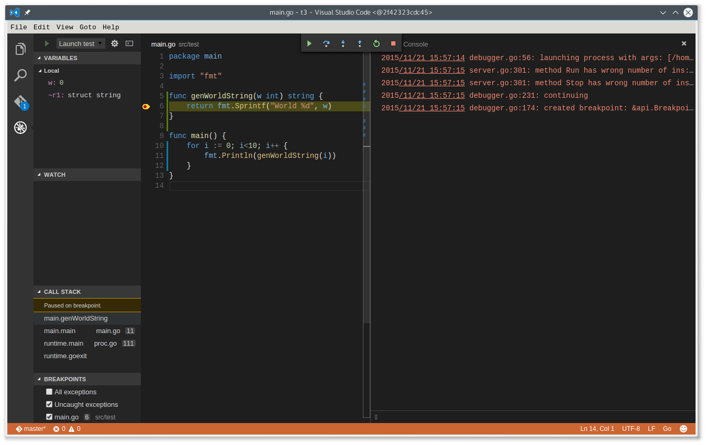

# vscode-go in a container

[](https://quay.io/repository/ulrichschreiner/vsc)



This repository bundles VisualStudioCode and their vscode-go extension as well
as a bunch of go tools in a container.

Start this container with `vsc` in your current workspace from the command
line; you can also start it simply in your `$HOME` directory. Your user settings and 
extensions will be stored in your `$HOME/.config/vsc` folder but your project settings 
will stay in your workspace's `.vscode` subdirectory.


## Debug Support

[delve](https://github.com/derekparker/delve) is installed in the container too.
When using `gb` to build the binary, you should create a new launch configuration
in vscode with content like this (if your binary is `bin/test`):
```
{
	"version": "0.2.0",
	"configurations": [
		{
			"name": "Launch test",
			"type": "go",
			"request": "launch",
			"mode": "exec",
			"program": "bin/test",
			"env": {},
			"args": []
		}
	]
}
```
Note the `mode` which is `exec`; in this case `dlv` will take the binary as it is.
Now you can build your binary in a shell with `go build` and debug it inside
of vscode with delve!

## Startup
You can use the given `vsc` script or you put the following in your `.bashrc`
(or anything compareable if you're not using bash):
```
_vsc() {
  docker pull quay.io/ulrichschreiner/vsc
  docker run -it --rm \
      --net=host \
      --ipc=host \
      --privileged \
      -v /tmp/.X11-unix:/tmp/.X11-unix  \
      -v `pwd`:`pwd` \
      -w `pwd` \
      -v $HOME/.config:/config \
      -e DISPLAY=unix$DISPLAY \
      -v $HOME/.gitconfig:/devhome/.gitconfig \
      -v $SSH_AUTH_SOCK:/ssh-agent --env SSH_AUTH_SOCK=/ssh-agent \
      -v $HOME/.git-credential-cache:/devhome/.git-credential-cache \
      -v /run/docker.sock:/run/docker.sock:ro \
      --device /dev/dri \
      -e LANG=$LANG \
      -e HOSTUSER=`id -un` \
      -e HOSTGROUP=`id -gn` \
      -e HOSTUSERID=`id -u` \
      -e HOSTGROUPID=`id -g` \
      -e WORKSPACE=`pwd` \
      -e DISABLE_GPU="--disable-gpu" \
      quay.io/ulrichschreiner/vsc "$@"
}
alias vsc=_vsc
```
Ensure to have the `-it` parameters when starting the container because VSCode needs a terminal!

Note: If you have private repositories where you need your SSH keys, you should have an agent running before starting `vsc` so the agent forwarding of the keys will work.

When using this alias you do not need to clone this repository. `docker` will
pull the public image, so be patient when doing this the first time. Note: there is no versioning of the containers at this time. Do a regularly `docker pull quay.io/ulrichschreiner/vsc` to keep the image up to date (the given alias function does this for you).

## GPU Rendering

If you see a black window you can add `-e DISABLE_GPU="--disable-gpu"` to your start script.

# Alternative

Don't like *Visual Studio Code*? Well give [atocker](https://github.com/ulrichSchreiner/atocker) a try!
